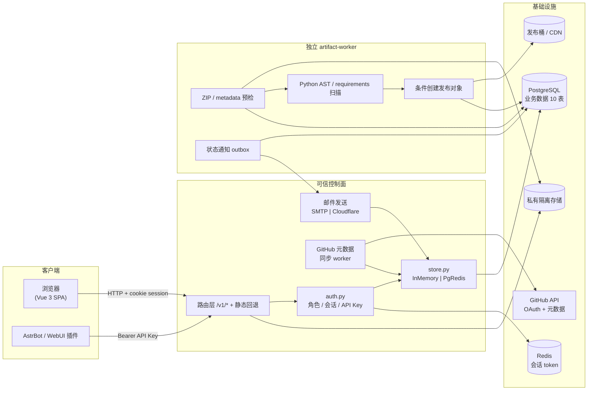

# 架构

AstrBot Community Plugins 是一个服务端驱动的插件市场。FastAPI 负责可信控制面（市场 API、SPA 与插件源），独立 `artifact-worker` 负责 ZIP 预检、静态扫描、不可变对象发布和通知 outbox。P0/P1 不执行插件代码；后续 runtime smoke test 也不得进入 API 进程。

## 系统全景



仓库组织为两个应用：

1. `apps/market-web/` — Vue 3 + Vite SPA，渲染公开市场、主题、插件提交表单、管理后台与个人设置。生产构建产物输出到 `apps/market-web/dist`。
2. `apps/api/` — FastAPI 后端，提供 GitHub OAuth、插件 CRUD、审核、评论、点赞、通知、公告、用户管理、API Key 端点，并托管前端构建产物。使用 uvicorn 运行。

`registry/` 与 `packages/` 为预留空目录，当前不含代码。

## 后端架构

应用代码集中在 `apps/api/app/`，文件职责单一：

| 文件 | 职责 |
|---|---|
| `main.py` | `create_app()` 工厂、lifespan、全部路由注册、静态文件回退、GitHub 元数据同步、邮件发送 |
| `config.py` | `Settings` dataclass、`load_settings()`、环境变量与运行时配置合并 |
| `schemas.py` | Pydantic 2 请求体模型（提交、评论、setup、系统设置、邮件等） |
| `auth.py` | `Role` 枚举、权限函数（`can_edit_plugin` / `can_manage_plugin_submission`）、密码哈希、API Key 校验 |
| `store.py` | `InMemoryMarketStore` + `PgRedisMarketStore` + `SCHEMA_SQL` |
| `env_file.py` | `.env` 文件读写工具（setup 写入基础设施连接） |
| `schema_migrations.py` / `migrations/` | 带 checksum、advisory lock 的版本化 SQL migration |
| `artifacts/` | artifact 状态机、Repository、隔离存储、预检、静态扫描、发布、通知与独立 Worker |

### 启动流程

模块级 `app = create_app()` 完成单例初始化（`main.py`）：

```
create_app(settings, store)
  ├── app = FastAPI(lifespan=lifespan)
  ├── app.state.settings = settings or load_settings()
  ├── app.state.store = store or create_store(settings)   ← 按 DATABASE_URL/REDIS_URL 选择存储
  ├── app.state.artifact_runtime = build_artifact_runtime(...)
  ├── 注册 CORS 中间件（来源 = settings.cors_origins）
  ├── 注册 HTTPException 处理器
  ├── register_routes(app)              ← 挂载全部 API 路由
  └── register_market_web_routes(app)   ← 挂载 SPA / 静态文件回退
```

`lifespan` 管理启动/关闭事件：

- **API 启动**：`store.connect()`（同时执行版本化 migration）→ 构造 artifact 控制面组件但不启动任务循环 → 创建核心管理员 → 启动 GitHub metadata 同步。
- **独立 Worker**：`python -m app.artifacts.worker` 通过 PostgreSQL lease + `FOR UPDATE SKIP LOCKED` 领取任务；任务超时后可由其他实例接管。
- **关闭**：API 取消 metadata worker 并关闭存储；artifact-worker 停止领取任务并释放连接。

### 存储抽象与切换

`create_store()`（`main.py`）按配置选择实现：

- **同时**配置 `DATABASE_URL` 与 `REDIS_URL` → `PgRedisMarketStore`（生产）。
- 否则 → `InMemoryMarketStore`（开发 / 首次启动，不持久化）。

`PgRedisMarketStore` 继承 `InMemoryMarketStore`，覆写全部业务方法为 PostgreSQL 实现；Redis 仅承载会话 token。`/v1/setup` 完成初始化后通过 `activate_setup_store()` 动态替换 `app.state.store`，**当前进程内热切换，无需重启**。

## 数据模型

### PostgreSQL

| 表 | 主键 | 核心字段与约束 |
|---|---|---|
| `market_users` | `id` | `github_id`（UNIQUE）、`internal_username`（UNIQUE）、`password_hash`、`auth_source`、`github_token`、`role`（CHECK: core_admin/admin/user）、`muted_until/by/reason` |
| `market_plugins` | `id` | `name`（UNIQUE）、`repo`（UNIQUE）、`display_name`、`desc_text`、`tags`（jsonb, GIN 索引）、`owner_user_id`（FK）、`owner_github_login`、`status`（pending/listed/unlisted）、`stars`、`likes`、`comments_count`、`metadata`（jsonb） |
| `market_submissions` | `id` | `plugin_id`（FK CASCADE）、`user_id`（FK CASCADE）、`payload`（jsonb）、`status` |
| `market_comments` | `id` | `plugin_id`（FK）、`user_id`（FK）、`parent_id`（自引用 FK，支持嵌套）、`body`、`likes`、`muted`、`deleted`、`deleted_by/at`；partial index `WHERE deleted = false` |
| `market_plugin_likes` | (plugin_id, user_id) | 联合主键保证每用户对每插件唯一点赞 |
| `market_comment_likes` | (comment_id, user_id) | 联合主键保证评论点赞唯一 |
| `market_announcements` | `id` | `title`、`body`、`author_user_id`（FK） |
| `market_notifications` | `id` | `user_id`（FK）、`type`、`title`、`body`、`metadata`（jsonb）、`dedupe_key`（artifact 通知可选唯一键）、`read` |
| `market_api_keys` | `id` | `name`、`user_id`（FK）、`scopes`（jsonb）、`key`（UNIQUE） |
| `market_options` | `option_key` | `option_value`；存储运行时站点/OAuth/市场/邮件系统设置 |

artifact migration 另建 `plugin_artifacts`、`artifact_files`、`review_runs`、`review_findings`、`review_decisions`、`artifact_jobs`、`outbox_events` 和 `market_schema_migrations`。`market_plugins.repo_version` 随仓库 metadata 更新，`current_artifact_id` 只由发布事务修改。历史 migration 的 checksum 变化会阻止启动，避免静默篡改。

核心约束：`(plugin_id, archive_sha256)` 幂等、已发布 `(plugin_id, normalized_version)` 唯一、隔离/发布 key 唯一、人工决策与任务 idempotency key 唯一。发布事务再次锁定插件与 artifact 并校验仓库版本。

### Redis

仅在 `PgRedisMarketStore` 中使用，**只存会话 token**：

- Key 格式：`astrbot_market:session:{token}`
- Value：JSON 序列化的 `{token, user_id, created_at, last_seen_at}`
- TTL 由 `SESSION_MAX_AGE_SECONDS` 控制（默认 7 天）；每次 `get_user_by_session()` 读取时刷新 TTL。

### InMemoryMarketStore

开发/首次启动用 Python `dict` 管理全部业务集合：`users`、`plugins`、`submissions`、`comments`、`pluginLikes`、`commentLikes`、`announcements`、`notifications`、`apiKeys`、`options`、`sessions`。

## API 端点清单

路由统一在 `/v1/*`（AstrBot 源端点与静态回退除外），按职责分组。完整契约以 FastAPI 运行时自动生成的 `/openapi.json` 为权威；`/docs/rest` 提供 Vue + Naive UI API Reference，`/docs` 与 `/redoc` 保留 FastAPI 原生文档视图。本表为概览。

### 公开端点（无认证）

| 方法 | 路径 | 功能 |
|---|---|---|
| GET | `/health` | 健康检查（含 setup 状态、DB/Redis 是否配置） |
| GET | `/v1/site` | 公开站点配置（名称、图标、认证与市场开关） |
| GET | `/v1/setup/status` | setup 状态（仅首次设置前可用，脱敏） |
| POST | `/v1/setup` | 执行初始化：建库、建表、创建管理员、写 `.env`（仅 setup_required 时） |
| GET | `/v1/plugins` | 已上架插件列表（status=listed） |
| GET | `/v1/plugins/{id}` | 插件详情（含评论树、点赞状态） |
| GET | `/v1/plugins/submissions` | 待审核提交列表（admin） |
| POST | `/v1/plugins/submissions` | 提交新插件（登录） |
| GET | `/v1/announcements` | 公告列表 |
| GET | `/plugins.json` · `/plugins-md5.json` | AstrBot 插件源 feed 与 MD5 摘要 |
| GET | `/v1/astrbot/plugins(.json\|-md5.json)` | 带 `v1` 前缀的等价源端点 |

### 认证

| 方法 | 路径 | 功能 |
|---|---|---|
| POST | `/v1/auth/internal/login` | 内部账号登录（用户名 + 密码） |
| GET | `/v1/auth/github/login` | 跳转 GitHub OAuth 授权页 |
| GET | `/v1/auth/github/callback` | OAuth 回调，创建 session |
| POST | `/v1/auth/logout` | 注销（清 cookie + Redis session） |
| GET | `/v1/auth/session` | 校验当前 session |
| GET | `/v1/auth/debug-login` | 开发调试登录（`ENABLE_DEV_AUTH=true` 时） |

### 当前用户（登录）

| 方法 | 路径 | 功能 |
|---|---|---|
| GET | `/v1/me` | 当前用户信息 |
| PATCH | `/v1/me/profile` | 更新资料（头像、github_token、通知偏好） |
| GET | `/v1/me/plugins` | 我的插件 |
| GET/POST/DELETE | `/v1/me/api-keys[/{id}]` | 个人 API Key CRUD |
| GET | `/v1/me/notifications` | 通知列表（分页） |
| GET | `/v1/me/notifications/unread-count` | 未读计数 |
| POST | `/v1/me/notifications/read` | 全部标记已读 |
| DELETE | `/v1/me/notifications[/{id}]` | 清空 / 删除单条 |
| POST | `/v1/me/notifications/delete` | 批量删除 |

### 插件互动（登录）

| 方法 | 路径 | 功能 |
|---|---|---|
| PATCH | `/v1/plugins/{id}` | 编辑元数据（所有者或 admin） |
| POST | `/v1/plugins/{id}/request-list` | 申请上架（所有者） |
| POST | `/v1/plugins/{id}/unlist` | 自主下架（所有者） |
| POST | `/v1/plugins/{id}/refresh-github` | 手动刷新元数据（所有者） |
| POST | `/v1/plugins/{id}/like` · `unlike` | 点赞 / 取消点赞 |
| POST | `/v1/plugins/{id}/comments` | 添加评论 |
| POST/DELETE | `/v1/comments/{id}[ /like\|/unlike]` | 评论点赞 / 删除（作者或 admin） |

### 管理员（admin）

| 方法 | 路径 | 功能 |
|---|---|---|
| GET | `/v1/admin/check` · `/v1/permissions` | 当前用户权限位 / 功能权限 |
| GET | `/v1/admin/summary` | 后台统计摘要 |
| GET | `/v1/admin/plugins` | 全部插件（含 unlisted） |
| POST | `/v1/admin/plugins/{id}/list` | 审核通过上架 |
| POST | `/v1/admin/plugins/{id}/unlist` | 下架（需 reason，通知所有者） |
| POST | `/v1/admin/plugins/{id}/refresh-github` | 异步刷新元数据 |
| DELETE | `/v1/admin/comments/{id}` | 删除评论 |
| GET | `/v1/admin/users` | 用户列表 |
| POST | `/v1/admin/users/{id}/mute` · `unmute` | 禁言 / 解禁 |
| POST | `/v1/api-keys` · GET `/v1/api-keys` | 颁发全局 Key / 列出 Key（Bearer market:read） |

### 核心管理员（core_admin）

| 方法 | 路径 | 功能 |
|---|---|---|
| GET/PUT | `/v1/admin/settings` | 读取 / 更新系统设置（脱敏） |
| POST | `/v1/admin/settings/email/test` | 发送测试邮件 |
| GET | `/v1/admin/setup/status` | setup 状态（含已保存脱敏配置） |
| POST | `/v1/core/users` · DELETE `/v1/core/users/{id}` | 创建 / 删除内部用户 |
| POST | `/v1/core/admins/{id}` | 修改用户角色（admin ↔ user） |
| POST | `/v1/core/announcements` | 发布公告 |

### 静态回退

`/` 与 `/{full_path:path}` 由 `register_market_web_routes` 处理，返回 `apps/market-web/dist/index.html` 或对应静态资源；通过 `is_reserved_api_path()` 排除 `v1`、`health`、`plugins.json`、`plugins-md5.json`、`openapi.json`、`docs`、`redoc` 等保留路径，避免覆盖 API 路由与文档页。

## 认证与权限模型

### 角色与能力矩阵

| 能力 | core_admin | admin | user |
|---|:---:|:---:|:---:|
| 管理系统设置 / 邮件 | ✅ | — | — |
| 管理管理员 / 创建删除内部用户 | ✅ | — | — |
| 发布公告 | ✅ | — | — |
| 审核上架/下架、刷新任意插件 | ✅ | ✅ | — |
| 删除评论、禁言用户 | ✅ | ✅ | — |
| 编辑自有插件 | ✅ | ✅（任意） | ✅（仅自己） |
| 提交 / 评论 / 点赞 / 个人 Key | ✅ | ✅ | ✅ |

权限函数：`can_edit_plugin(user, plugin)`（admin 或所有者匹配）、`can_manage_plugin_submission(user, plugin)`（admin 或所有者），定义于 `auth.py`。

### 登录方式

1. **GitHub OAuth** — `/v1/auth/github/login` → 授权 → `/v1/auth/github/callback`，`upsert_github_user` 创建/关联用户并建 session；若属于 `GITHUB_ADMIN_ORG` 且非 admin 则自动提权。
2. **内部账号** — `/v1/auth/internal/login`（用户名 + 密码，PBKDF2-SHA256 哈希）。
3. **开发调试** — `/v1/auth/debug-login`（仅 `ENABLE_DEV_AUTH=true`，通过 `X-Dev-GitHub-Login` 头自动建用户）。

会话基于 cookie（`astrbot_market_session`），非 JWT。token 格式 `sess_{token_urlsafe(24)}`，存于 Redis。详见 [security.md](security.md)。

## 关键机制

### 配置双层

- **静态层**：`.env` 环境变量（基础设施连接、`ENABLE_DEV_AUTH` 等启动期常量）。
- **运行时层**：`market_options` 表（站点展示、GitHub OAuth、市场策略、邮件），核心管理员通过 `/v1/admin/settings` 修改，热更新当前 API 进程。
- `runtime_settings_for_app()` 将运行时层合并到 `Settings`，实现无需重启的配置更新。Web 后台设置覆盖 `.env` 同名项。

### 首次启动热切换

`/v1/setup` 流程：连接 PostgreSQL（目标库不存在则创建）→ 初始化 schema → 验证 Redis → 写入核心管理员 → 全部成功才写 `.env`（任何一步失败都不写）→ `activate_setup_store()` 进程内切换到 PgRedis 存储 → 关闭 `/v1/setup`。基础设施连接后续只通过 `.env` 修改。

### GitHub 元数据同步

- API lifespan 的 metadata worker 周期性抓取仓库 stars、README、版本等；版本写入 `market_plugins.repo_version`，仓库中的 `download_url` 不参与同步。
- `GITHUB_API_TOKEN` 支持多 token（`,` / `;` / 换行分隔），通过 `app.state.github_api_token_index` 轮转，应对速率限制；刷新遇 rate limit 会向上游报告。
- 所有者可带临时 token 手动刷新（`/v1/plugins/{id}/refresh-github`），管理员触发异步刷新（`/v1/admin/plugins/{id}/refresh-github`）。

### 通知系统

评论回复、插件点赞和评论点赞沿用站内通知。artifact 状态通知先写 `outbox_events`，再由独立 Worker 以 lease 领取，发送站内信和可选邮件；站内信使用 outbox event dedupe key 条件写入，worker 重试不会重复建站内记录。邮件只含状态、原因和 `/plugin-workbench?artifact=...` 链接，不附带源码或证据片段。

站内通知以 PostgreSQL 唯一键实现 exactly-once 可见记录；外部 SMTP/Cloudflare 邮件是 at-least-once 提醒，进程在发送成功但确认 outbox 前崩溃时可能产生重复邮件。系统不以邮件投递结果作为审查或发布状态依据。

管理员下架当前版本时，decision、`revoking` 状态、插件移出 feed 和 revoke job 在同一事务完成。公开对象删除失败会保留当前指针并进入 `revoke_failed`，插件仍保持不可见，管理员可重试下架。

### API Key

- **全局静态**：`MARKET_API_KEYS` 环境变量，格式 `name:key:scope1|scope2`。
- **管理员动态颁发**：`POST /v1/api-keys`（admin），`sk-ah-` 前缀。
- **个人 Key**：`/v1/me/api-keys`，登录用户自建自删。
- 通过 `Authorization: Bearer <key>` 鉴权，校验逻辑在 `auth.py`。原文只在创建响应中返回一次，列表仅返回名称、scopes 与创建时间。

### 邮件服务

`EMAIL_PROVIDER` 决定后端：

- `disabled`（默认）— 发送即返回 400。
- `smtp` — `aiosmtplib`，默认自动 STARTTLS/认证协商；可显式设置 `STARTTLS`、`SSL/TLS`、不加密、`AUTH LOGIN` 或 `AUTH PLAIN`。
- `cloudflare` — Cloudflare Email Sending API `POST /accounts/{account_id}/email/sending/send`。

`EMAIL_DAILY_LIMIT` 控制每日上限（内存计数器，按日清零）。详见 [security.md](security.md)。

## 前端架构

`apps/market-web` 为 Vue 3 + Vite+（Vite Plus）SPA，使用 TypeScript + `<script setup>` 与 Composition API。

| 层 | 选型 |
|---|---|
| 构建工具 | Vite+（Vite Plus）— `vp dev` / `vp build` / `vp staged`，配置见 `vite.config.ts` |
| 语言 | TypeScript（strict），类型定义见 `src/types/index.ts` |
| UI 库 | Naive UI 2.43（`NConfigProvider` / `NLayout` / `NForm` / `NDialog` 等） |
| 路由 | Vue Router 4，`createWebHistory` |
| 状态管理 | Pinia 3；市场域使用 `stores/plugins.ts`，artifact 工作台使用独立 `stores/artifacts.ts` |
| HTTP | 原生 `fetch`，统一 `credentials: 'include'` |
| Markdown | `marked` + `DOMPurify` + `highlight.js` |
| 评论 | `@giscus/vue` |
| 图标 | `@vicons/ionicons5` |

### 路由与守卫

| path | 组件 | 说明 |
|---|---|---|
| `/` | `Home.vue` | 首页 / 插件市场 |
| `/setup` | `Setup.vue` | 首次配置向导 |
| `/submit` | `SubmitPlugin.vue` | 提交插件 |
| `/admin` | `AdminLogin.vue` | 后台登录 |
| `/admin/settings` | `Settings.vue` | 系统设置（core_admin） |
| `/admin/plugins` | `AdminPlugins.vue` | 插件审核（admin） |
| `/settings/personal` | `PersonalSettings.vue` | 个人设置 |
| `/notifications` | `Notifications.vue` | 通知中心 |
| `/plugin-workbench` | `PluginWorkbench.vue` | 作者版本历史 / 管理员审查队列（需登录） |
| `/docs/rest` | `RestDocs.vue` | REST API 文档（Vue + Naive UI） |

`/plugin-workbench` 使用 `meta.requiresAuth` 与异步 `beforeEach` 守卫；最终权限仍由后端逐端点强制。`App.vue` 继续负责首次 setup 跳转，管理员能力由服务端角色校验。


Base URL 仍由 `stores/plugins.ts` 统一解析；artifact store 复用该公开值，不复制环境解析逻辑。

store 管理的状态与 action 按域分组：插件 CRUD、评论、点赞、管理员操作、个人 Key、通知、认证、系统配置、公告、主题、搜索过滤。

### 关键组件

- 通用：`AppHeader`、`AppFooter`、`PluginCard`、`PluginDetails`（含站内 README 浏览与仓库文件导航）、`PluginComment`、`SearchToolbar`、`AppPagination`、`ThemeModeButton`、`IrisMask`（页面切换动画）。
- `components/settings/`：`AccessKeyManager`、`AdminUserManagement`、`NotificationPreferencesSection`、`PersonalPluginManager`、`ProfileAccountSection`。

### 构建

根 `package.json` 暴露工作区脚本：`dev:web`、`build:web`、`dev:api`、`start:api`、`test`。前端使用 Vite+ CLI（`vp dev` / `vp build`），配置见 `vite.config.ts`（`defineConfig` 来自 `vite-plus`）。设置 `VITE_BASE_URL` 时构建自动生成 `sitemap.xml` 与 `robots.txt`（`vite-plugin-sitemap`）。Vite+ pre-commit hook（`.vite-hooks/pre-commit`）在暂存前端文件时自动执行 `vp staged`（`vp check --fix`）。

## 部署架构

单服务在 `:8787` 按路径分发：

- `/` 与 SPA 路由 → `apps/market-web/dist/index.html`
- `/assets/...`、`/font/...` → 构建静态资源
- `/plugins.json`、`/plugins-md5.json`、`/v1/astrbot/...` → AstrBot 插件源
- `/v1/...` → 市场 API
- `/openapi.json`、`/docs/rest`、`/docs`、`/redoc` → OpenAPI JSON、Vue API Reference 与 FastAPI 原生文档

可用部署方式：

- **Docker Compose** — 默认 app + PostgreSQL + Redis；`--profile artifacts` 增加共享隔离卷与独立 artifact-worker。
- **systemd** — API 与 `astrbot-artifact-worker.service` 分进程运行，并只向配置的 artifact 目录授予写权限。

尚未提供：Kubernetes/Helm、Nginx/Caddy 反向代理模板和 Terraform。CI 仅 lint + 测试 + 前端构建，不含部署。

## AstrBot 集成

AstrBot 仍消费 `repo + download_url`。`repo` 永久保留；feed 的 `version` 优先使用仓库 `repo_version`。只有当前 published artifact 版本与之规范化相等时才输出 CDN `download_url`，否则为空且不覆盖/删除旧稳定对象。
