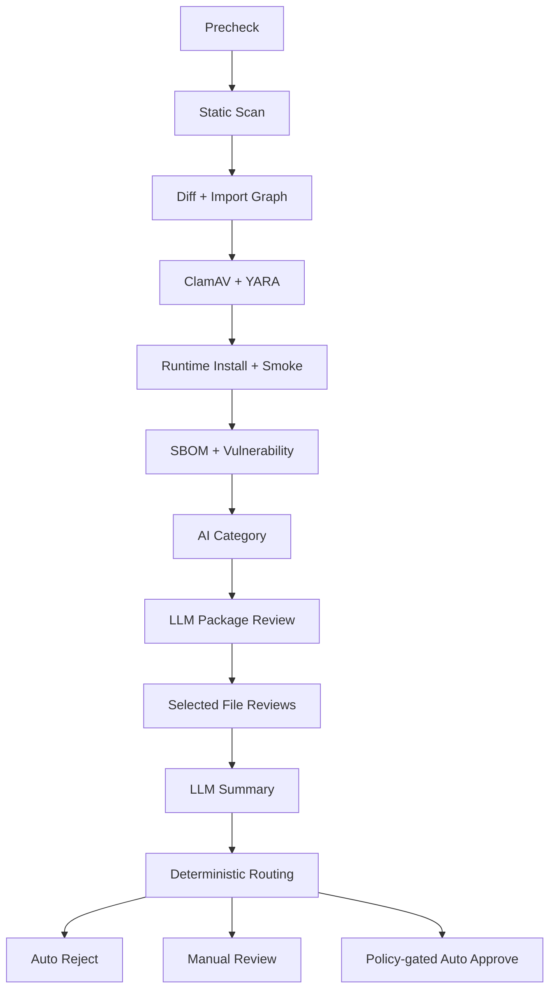

# 插件制品高级审查系统 - 设计文档

## Overview

本设计在已完成的 P0/P1 制品闭环上继续增加 P2-P4 能力，不改写已验证的基础模型：

- `plugin` 仍是稳定身份、仓库、所有权和当前发布指针。
- `artifact` 仍是绑定源码 revision、版本、ZIP SHA 和 tree SHA 的不可变候选。
- `review run` 仍是某个工具/模型对某个 artifact 的一次不可变执行记录。
- `finding` 仍是结构化风险事实或自动审查建议。
- `decision` 仍是唯一能改变候选审查终态、发布或撤回状态的审计动作。
- `publication` 仍只指向已经批准且对象摘要与 artifact 一致的 CDN 包。

高级阶段只扩展审查证据、工作台和策略控制，不允许 LLM、容器或安全工具直接修改插件发布指针。

### 目标

1. 在一次性隔离环境中验证 AstrBot 依赖安装、插件导入、初始化和 Handler/Tool 注册。
2. 使用结构化 LLM 审查提高人工复核效率，但不把模型结论当作最终安全背书。
3. 用确定性 diff 和 Python import 图缩小更新审查范围，同时对不完整图明确降级。
4. 为作者和管理员提供受限源码浏览、diff、行级评论、要求修改和完整历史。
5. 接入恶意软件、YARA、依赖漏洞和版本化策略，所有工具降级均 fail visible。
6. 保持 `repo`、GitHub 直连、版本同步、CDN key 和 `/plugins.json` 契约兼容。

### 核心不变量

- artifact 的版本必须来自该 artifact 固定源码 revision 中的 `metadata.yaml/yml`，不得从旧市场记录推断。
- GitHub artifact 在创建时固定 commit SHA；分支后续变化不改变已有 artifact。
- `repo_version` 可随仓库 metadata 更新；`published_version` 仍由 `current_artifact_id` 派生。
- `repo_version != published_version` 时公开 CDN URL 为空，`repo` 始终保留。
- 未通过审查的新 artifact 不覆盖旧 artifact、旧 CDN 对象或当前发布指针。
- `critical` 是风险等级，不是可由客户端设置的 artifact 状态。
- LLM 结果只能增加风险或建议复核，不能降低确定性 finding、批准、撤回或执行命令。
- API 进程和普通 artifact worker 永远不导入插件、不安装插件 requirements、不执行插件 subprocess。
- 只有独立 runtime runner 能创建沙箱；不受信任容器拿不到数据库、Redis、对象存储、LLM 或 Docker 凭据。
- 每个 artifact 在进入预检时固定一个不可变 policy version，后续阶段和决定都引用该快照。
- 每个 run 的输入集合、工具版本、输出摘要和覆盖范围可重放、可解释、不可被后续 run 原地覆盖。
- 候选 artifact 的 critical 默认只拒绝候选；只有确定性关联或管理员确认才能撤回当前稳定版本。

### 阶段映射

| 阶段 | 主要能力 | 默认门禁 |
| --- | --- | --- |
| P2 | runtime、AI 分类、LLM package/file/summary、自动路由 | 高级服务可选启用；失败进入人工复核，不能伪造成功 |
| P3 | artifact diff、import 图、文件浏览、评论、要求修改、历史 | 所有读取后端鉴权；增量不完整时退化全量/人工 |
| P4 | ClamAV、YARA、SBOM/漏洞、网络策略、review policy | 生产自动通过前必须具备完整确定性工具链 |

## Architecture

### 总体拓扑

```mermaid
flowchart LR
    Web[Vue Plugin Workbench] --> API[FastAPI Control API]
    API --> PG[(PostgreSQL)]
    API --> Private[Private Artifact Storage]

    Worker[Artifact Worker] --> PG
    Worker --> Private
    Worker --> LLM[LLM Provider]
    Worker --> Clam[ClamAV Service]
    Worker --> Vuln[Vulnerability Data Adapter]

    Runner[Dedicated Runtime Runner] --> Dispatch[(Runtime Dispatches)]
    Runner --> Private
    Runner --> Engine[Rootless Container Engine]

    Engine --> Install[Install Sandbox]
    Engine --> Smoke[No-network Smoke Sandbox]
    Install --> Result[Structured Private Result]
    Smoke --> Result
    Result --> Private

    Worker --> Published[Published Object Storage]
    Published --> CDN[CDN]
    API --> Feed[/plugins.json]
```

### 控制面与执行面

#### FastAPI 控制面

FastAPI 只负责：

- 登录、角色、所有权、限流和请求校验；
- artifact、文件、diff、评论、历史、策略和健康 API；
- 在数据库事务中创建 artifact、decision、comment event、policy event 和持久 job；
- 返回受限、分页、已转义的结构化结果；
- 组合 `/plugins.json`，不主动运行任何审查阶段。

API 不持有容器引擎 socket，不调用 `pip`，不执行 artifact 中的 Python，不读取容器私有工作目录。

#### Artifact Worker 控制执行器

现有 `ArtifactJobRunner` 继续承担确定性编排，但拆出小型 stage handler，避免一个文件持续增长。它负责：

- 领取/续租 artifact jobs；
- 固定 policy snapshot 并计算阶段 DAG；
- 执行预检、静态、diff/import 图、分类、LLM、malware、dependency、routing；
- 为 runtime 创建 dispatch，不直接创建容器；
- 校验 runner/模型/scanner 返回的 JSON、hash、行号和工具版本；
- 生成 findings、decisions、通知、发布和撤回任务。

普通 worker 可以持有数据库、私有对象存储和 LLM 凭据，但没有 Docker/Podman socket。

#### Runtime Runner 执行器

`runtime-runner` 是独立服务和独立部署单元：

- 只读取 `runtime_dispatches` 所需字段，使用单独数据库用户或等价最小权限队列；
- runner 宿主读取指定 quarantine 对象，校验 SHA 后放入一次性工作目录；
- 只有 runner 宿主进程连接 rootless Docker/Podman/Kubernetes executor；
- 不把数据库、Redis、对象存储或 runner socket 挂入插件容器；
- 将结构化结果和受限日志写回私有对象，更新 dispatch 终态；
- 无论成功、失败、超时或 runner 崩溃都通过租约回收并清理容器/volume/network。

本地开发可使用 opt-in Docker profile。生产必须将 runner 放到单独节点或独立安全域，并使用 rootless engine；挂载宿主 root Docker socket 仅可作为明确标记的开发降级，不能报告为生产级隔离。

### 信任边界

| 输入/组件 | 信任级别 | 允许动作 | 禁止动作 |
| --- | --- | --- | --- |
| ZIP/GitHub 源码 | 不可信 | 受限读取、hash、静态分析、沙箱执行 | API/worker import、宿主执行 |
| LLM 输出 | 不可信建议 | schema 校验、行号复核、生成建议 finding | 降级确定性风险、直接 decision |
| ClamAV/YARA/漏洞服务输出 | 外部工具结果 | 版本化解析、按策略映射 finding | 未运行时显示 clean |
| Runtime runner 结果 | 受控但需验证 | schema/hash/signature 校验后写 run | 直接修改 artifact/publication |
| Reviewer decision | 受鉴权人工输入 | 通过领域服务改变状态 | 绕过 policy/状态机/自审限制 |
| Policy | 核心管理员控制 | 固定 stage、阈值、资源与自动路由 | 保存密钥正文、原地修改 active version |

### 审查 DAG



实际启用阶段由 artifact 固定的 policy 决定。DAG 规则：

- precheck 硬失败立即终止后续阶段并自动拒绝；
- 其他确定性阻断结果可跳过成本较高的 LLM，但仍保存“因阻断未运行”的覆盖说明；
- 工具 unavailable/degraded、LLM 失败、token 超限、diff/import 图不完整都不能被解释为成功；
- 所有必需阶段完成后才创建唯一 `route_review` job；
- `route_review` 只消费已完成 run、open findings 和 policy snapshot，不直接调用外部工具；
- 同一 artifact/stage/policy/tool version 使用唯一幂等键，重试创建新 attempt，不覆盖旧 run。

### Runtime 两阶段沙箱

#### Install sandbox

安装阶段使用 policy 固定的 Python image digest：

1. 创建临时 venv/volume。
2. 执行 `pip install AstrBot==<target_version>`。
3. 安装 artifact 的 `requirements.txt`，保留解析日志但脱敏 URL 凭据。
4. 执行 `pip check`，比较 AstrBot 安装前后核心依赖版本。
5. 生成最终依赖清单和 CycloneDX SBOM。

网络只允许 policy 指定的 DNS、代理和包源。禁止私网、cloud metadata、宿主回环、站点 PostgreSQL/Redis、对象存储管理端和任意互联网出口。

#### Smoke sandbox

smoke 使用新的容器实例：

- 复用 install 产出的只读 venv/snapshot；
- 网络模式为 none；
- rootfs 只读，`ASTRBOT_ROOT`、`/tmp` 和日志目录使用限额 tmpfs；
- artifact 以只读方式复制到 `data/plugins/<normalized_directory>`；
- 设置 `TESTING=true`，使用随机本地 dashboard port 和最小临时 WebUI；
- 通过 AstrBot `AstrBotCoreLifecycle.initialize()`/`PluginManager` 的真实加载路径收集结果；
- 检查 `failed_plugin_dict`、`StarMetadata`、`star_handler_full_names` 和 plugin-owned LLM tools；
- 调用正常 shutdown/`terminate()`，然后强制销毁容器。

当前源码基线为 AstrBot `4.26.6`（`5d10e0d428b41308cc63215db00359c61ee17195`），其加载路径会验证 metadata 和 `astrbot_version`、恢复 requirements、实例化 `Star`、绑定 Handler/LLM Tool、调用 `initialize()`。runner 使用版本适配器，不把该内部调用约定硬编码为跨版本永恒契约；仓库版本变化后必须先审计 lifecycle diff，再更新适配器。

### AstrBot 目标版本解析

`RuntimeTargetResolver` 输入 artifact metadata 和 policy：

1. artifact version 始终来自固定 source revision 的 metadata；该值用于 CDN 路径和发布版本。
2. AstrBot runtime target 是独立字段，由 policy 的默认/矩阵和 metadata `astrbot_version` 求交。
3. 若 policy 指定 exact version，则必须满足 metadata specifier；不满足直接产生确定性 finding。
4. 若 policy 配置 version matrix，可按策略运行一个或多个 exact version；每个版本是独立 run。
5. 每个 run 保存 AstrBot package version、可选 source commit、Python version、image digest 和依赖 snapshot hash。
6. 仓库后续更新不会改变已完成 run；新 artifact 重新解析版本和执行。

### 自动路由

路由顺序固定：

1. 检查 precheck/malware/runtime/dependency 等确定性 blocking 条件，命中则 `auto_reject`。
2. 检查工具完整性、run 版本、coverage、diff/import 图、LLM JSON 和预算；不完整则人工复核。
3. 检查 open findings；任何 medium+ 阻止自动通过，policy 可让 low 也阻止。
4. 只有 policy 明确启用 `auto_approve` 且所有强制阶段成功、无降级、版本完全匹配时，创建 `auto_approve` decision。
5. 其他情况进入 `pending_review`。

路由结果保存 policy version、输入 run IDs、open finding fingerprints、coverage hash、理由和幂等键。LLM 的“安全”文本不是单独通过条件。

### 增量更新与 stable release

- 新 artifact 默认记录提交时的 `base_artifact_id=current_artifact_id`；后续人工要求修改可设置 `supersedes_artifact_id`。
- diff 绑定 `base_tree_sha256/current_tree_sha256`，任一不符即视为过期并重算。
- 审查集合是变更文件、反向依赖、入口到变更路径、确定性命中文件、强制文件和 LLM 建议文件的并集。
- metadata、requirements、入口变化始终触发完整 runtime 和 dependency stage。
- base 缺失、语法错误、动态 import 或图不完整时，增量结果只能作为提示，policy 选择全量或人工复核。
- 候选拒绝/要求修改不会改变 stable release。
- 候选 critical 只有通过同 SHA/同路径 deterministic fingerprint、依赖图或管理员确认与 current artifact 建立关联后，才创建撤回任务。

### Feature Flags 与部署顺序

高级功能按独立配置启用：

- `ARTIFACT_RUNTIME_ENABLED`
- `ARTIFACT_LLM_REVIEW_ENABLED`
- `ARTIFACT_DIFF_ENABLED`
- `ARTIFACT_MALWARE_SCAN_ENABLED`
- `ARTIFACT_DEPENDENCY_SCAN_ENABLED`
- `ARTIFACT_POLICY_ENGINE_ENABLED`
- `ARTIFACT_AUTO_APPROVE_ENABLED`，默认 `false`

部署顺序固定为：应用迁移 → 部署外部工具/runner → 激活 policy → 开启阶段 flag。未配置高级服务时 P0/P1 人工审查仍可用，但 UI 必须显示阶段未配置/降级，不能补写 succeeded run。

## Components and Interfaces

### 后端模块边界

在现有 `apps/api/app/artifacts/` 内按职责扩展：

```text
artifacts/
├── orchestration.py          # policy 固定、DAG、stage readiness、routing
├── policy.py                 # immutable policy schema/activation/evaluation
├── diff.py                   # file diff、unified hunks、tree hash validation
├── import_graph.py           # Python AST local import graph/coverage
├── content.py                # manifest-backed text/diff bounded reads
├── comments.py               # thread/event/line validation
├── history.py                # paginated review timeline projection
├── category.py               # deterministic hints + AI category adapter
├── llm_review.py             # package/file/summary orchestration and schemas
├── runtime_dispatch.py       # dispatch repository/client/result validation
├── malware.py                # ClamAV/YARA adapters and normalization
├── dependency.py             # requirements/SBOM/advisory normalization
├── findings.py               # severity/source/fingerprint/correlation helpers
├── stages/                   # small job handlers; no router/business duplication
└── runner_contract.py        # shared request/result JSON schemas only

apps/api/app/runtime_runner/
├── worker.py                 # independent process entrypoint
├── repository.py             # least-privilege dispatch claim/lease/update
├── executor.py               # ContainerExecutor Protocol
├── docker_executor.py        # rootless Docker implementation
├── astrbot_adapter.py        # version-aware install/smoke probe
├── network_policy.py         # install/smoke profile enforcement/attestation
└── cleanup.py                # containers, volumes, networks, temp roots
```

`runner_contract.py` 只能包含无凭据的 typed schema，不能导入 FastAPI app runtime 或市场 store。

### Stage Handler

```python
class ReviewStage(Protocol):
    job_type: str

    async def execute(self, context: StageContext) -> StageOutcome: ...
```

`StageContext` 只提供 artifact snapshot、policy snapshot、repository、storage、tool adapters 和 logger context。handler 返回：

- `completed`: run 成功，给出 coverage 和 findings；
- `blocked`: 确定性业务阻断，不重试；
- `degraded`: 工具未完整执行，按 policy 人工复核；
- `retryable_failure`: 外部/系统临时失败；
- `terminal_failure`: schema、配置或不可恢复错误。

状态推进统一由 `ReviewOrchestrator` 完成，stage handler 不直接批准/发布。

### Runtime Dispatch Contract

```python
class RuntimeDispatchRequest(BaseModel):
    schema_version: Literal["1"]
    dispatch_id: str
    artifact_id: str
    artifact_sha256: str
    quarantine_key: str
    policy_version_id: str
    target: RuntimeTarget
    limits: RuntimeLimits
    install_network_profile: str
    smoke_network_profile: Literal["none"]
    result_key: str


class RuntimeDispatchResult(BaseModel):
    schema_version: Literal["1"]
    dispatch_id: str
    artifact_sha256: str
    target: RuntimeTargetSnapshot
    install: InstallResult
    smoke: SmokeResult
    network_attestation: NetworkAttestation
    cleanup: CleanupResult
    logs_key: str | None
    result_sha256: str
```

请求不包含用户 Token、数据库 URL、对象存储密钥或 LLM key。runner host 通过自身 workload identity 读取唯一对象；插件容器只看到本地只读 ZIP/目录。

`SmokeResult` 至少包括：metadata、import、initialize、startup、Handler、LLM Tool、failed plugin record、termination 和资源/网络违规。控制 worker 校验 artifact SHA、dispatch ID、schema version、行/大小限制和结果 hash 后才完成 runtime run。

### ContainerExecutor

```python
class ContainerExecutor(Protocol):
    async def prepare(self, request: RuntimeDispatchRequest) -> PreparedRuntime: ...
    async def run_install(self, prepared: PreparedRuntime) -> InstallResult: ...
    async def run_smoke(self, prepared: PreparedRuntime) -> SmokeResult: ...
    async def attest_network(self, prepared: PreparedRuntime) -> NetworkAttestation: ...
    async def cleanup(self, prepared: PreparedRuntime) -> CleanupResult: ...
```

生产实现必须设置：非 root user、cap-drop all、no-new-privileges、seccomp/AppArmor、只读 rootfs、pids/memory/cpu/time 限额、tmpfs 限额和禁止 privileged/host network。Docker executor 的命令参数使用结构化 argv，不通过 shell 拼接 artifact 输入。

### Category Service

分类写入遵循单一优先级：

```text
reviewer > user > ai > legacy/default
```

- 用户提交的合法分类写 `category_source=user`。
- AI 只写 artifact 的 `suggested_category/confidence/reason`，不立即覆盖插件分类。
- 当插件当前分类为空/默认且 confidence 达到 policy 阈值时，可写 `category_source=ai`。
- reviewer 修改分类时写 `category_source=reviewer`，后续 AI 不覆盖。
- AI 分类输入只含 metadata、README 限长摘要、文件树和确定性标签。

### LLM Review Pipeline

#### Package review

`PackageReviewInput` 只包含：

- 规范化文件树和每文件大小/language/SHA；
- metadata、requirements 解析结果和 README 脱敏限长摘要；
- 静态/runtime/malware/dependency findings 摘要；
- base diff 统计、import 图 coverage 和 policy 说明。

输出 `PackageReviewResultV1`：风险摘要、建议分类、建议文件、理由、置信度、coverage notes。服务端拒绝未知文件、路径穿越、二进制和超限选择。

#### File review

候选集合按确定性并集构造，再按以下顺序分配预算：

1. 入口与 policy 强制文件；
2. deterministic medium+ 命中文件；
3. 变更文件和入口依赖路径；
4. package model 建议文件；
5. 其余低风险文件。

每个 file run 绑定 file ID/SHA、prompt version、model、input hash 和 token budget。输出 finding 后，服务端重新读取 manifest 对应内容，验证 line range 和 evidence；无法复核的 finding 以 `unverified_model_output` 记录为 run error/coverage note，不进入普通 finding。

#### Summary

summary 只消费规范化 package/file results 和确定性 findings。它不能编辑已有 finding，只能生成摘要、优先级和人工复核建议。UI 固定标识“自动审查建议”。

### Diff And Import Graph

#### File diff

- 以规范化 path + SHA 分类 `added/deleted/modified/unchanged`。
- rename 仅在 deleted/added 文件 SHA 完全相同且一一对应时确定。
- 文本 diff 使用确定性 unified hunks；二进制只返回 change type、SHA、size。
- hunk 私有对象绑定 base/current file SHA 和 tree SHA；读取前再次验证。

#### Import graph

- 使用 Python AST，不执行 import。
- 仅解析 artifact 内本地模块；第三方/stdlib 边保存为 external，不展开。
- 支持 `import x`、`from x import y`、相对 import 和 package `__init__.py`。
- `importlib`、`__import__`、`sys.path` 修改、语法错误和无法确定路径标记 graph incomplete。
- 保存 forward/reverse edges、entry reachability 和原因；删除文件使用 base graph 计算旧反向依赖。

### Content Service

`ArtifactContentService` 永远通过 `artifact_id + file_id` 查询 manifest：

- 不接受任意 filesystem path、quarantine key 或 content key；
- 只读取 `is_text=true`、SHA 未变且 size/line_count 在 policy 限制内的内容；
- API 使用 `start_line/line_limit`，返回实际 line range、file SHA 和 truncation；
- 响应 `Cache-Control: no-store`，不返回预签名对象 URL；
- diff 读取同样通过登记的 `diff_id/hunk_id`；
- 内容、diff、评论均作为纯文本/JSON，后端和前端不执行 Markdown/HTML。

### Comment Service

线程创建时校验：artifact 可审阅、角色、file ID/SHA、side、line range 和 diff hunk。评论本体不可覆盖更新，编辑/回复/resolve/reopen 通过 `review_comment_events` 追加事件。投影字段便于列表查询，但事件表是审计事实。

- 管理员可创建行级线程、回复、解决/重开和编辑自己的未锁定正文。
- 作者可回复并标记已处理，不能改管理员原文或最终解决状态。
- artifact 最终 approve/reject/changes_requested 后线程锁定；新 artifact 只引用旧 thread ID。
- 正文纯文本、限长、规范化换行；不解析 mention、HTML 或 Markdown。

### Review Policy

Policy JSON 使用版本化 Pydantic/JSON Schema，主要字段：

```json
{
  "schema_version": "1",
  "required_stages": ["static", "runtime", "dependency"],
  "runtime_targets": [{"astrbot": "4.26.6", "python": "3.12"}],
  "limits": {"cpu": 1, "memory_mb": 768, "pids": 128, "timeout_seconds": 120},
  "network_profiles": {"install": "pypi-only-v1", "smoke": "none"},
  "llm": {
    "enabled": true,
    "model": "configured-model",
    "max_tokens": 24000,
    "max_cost_microusd": 100000,
    "input_cost_microusd_per_million_tokens": 1000000,
    "output_cost_microusd_per_million_tokens": 4000000
  },
  "malware": {"clamav": true, "yara_ruleset": "market-v1"},
  "dependency": {"max_severity": "high", "max_data_age_hours": 24},
  "routing": {"auto_approve": false, "manual_review_at": "low"}
}
```

密钥只保存 config reference。activation 在事务中锁定 policy set，校验 schema、跨字段约束和所需工具 readiness，通过 partial unique index 保证只有一个 active 默认 policy。artifact 只保存 `policy_version_id`，run/decision 复制必要 snapshot hash。

### Malware And Dependency Adapters

#### ClamAV

通过 `clamd` INSTREAM 或等价协议扫描原始 quarantine ZIP；不把文件路径交给远端 daemon。保存 engine/database version、database time、target SHA、signature 和三态结果 `clean/infected/unknown`。`unknown/error/stale` 按 policy degraded/fail closed，绝不显示 clean。

#### YARA

YARA ruleset 由核心管理员激活，保存 version/content hash/source。扫描在限额 subprocess/service 内完成，命中只保存 namespace/rule/tags/file/offset 的受限摘要。规则错误/超时不覆盖其他工具结果。

#### Dependency

- 静态解析 requirements 的名称、specifier、marker、extra 和 source。
- install sandbox 输出最终 installed distributions、`pip check` 和 SBOM。
- advisory adapter 使用固定数据库快照/服务查询，保存 advisory ID、范围、修复版本、来源和数据时间。
- `not_queried/stale/error` 与 `no_known_vulnerability` 是不同状态。
- AstrBot 核心依赖降级、直接 URL/VCS/local、撤回版本、依赖混淆和 policy 许可证命中生成确定性 finding。

### Critical Correlation And Revoke

`StableRiskCorrelator` 只接受：

- current artifact 同 path + 同 file SHA 的 deterministic finding；
- current/base dependency graph 中同 package/version/advisory；
- 同 ruleset/tool version 的确定性 fingerprint；
- 管理员显式 `affects_current_release=true`，并填写理由。

LLM correlation 只能创建建议。真正撤回仍走现有 `request_revoke_artifact`：事务内先移出 feed/设 revoking，随后 worker 删除对象；通知作者和管理员，并保留旧 artifact 审计。

### API Surface

#### 作者/管理员共享

| 方法 | 路径 | 说明 |
| --- | --- | --- |
| GET | `/v1/artifacts/{id}/files` | 分页文件树 |
| GET | `/v1/artifacts/{id}/files/{file_id}/content` | 受限文本行分页 |
| GET | `/v1/artifacts/{id}/diff` | artifact diff 摘要/文件列表 |
| GET | `/v1/artifacts/{id}/diff/{diff_id}` | 受限 hunks |
| GET | `/v1/artifacts/{id}/comments` | 评论线程与投影 |
| POST | `/v1/artifacts/{id}/comments/{thread_id}/replies` | 作者/管理员回复 |
| GET | `/v1/artifacts/{id}/history` | runs/findings/events/decisions/publication 时间线 |

#### 管理员

| 方法 | 路径 | 说明 |
| --- | --- | --- |
| POST | `/v1/admin/artifacts/{id}/comments` | 创建行级线程 |
| POST | `/v1/admin/artifacts/{id}/request-changes` | 要求修改，理由必填 |
| POST | `/v1/admin/artifacts/{id}/findings/{finding_id}/status` | 接受/解决/误报审计 |
| POST | `/v1/admin/artifacts/{id}/stable-risk` | 确认是否影响当前版本 |

#### 核心管理员

| 方法 | 路径 | 说明 |
| --- | --- | --- |
| GET/POST | `/v1/core-admin/review-policies` | 列表/创建 draft |
| POST | `/v1/core-admin/review-policies/{id}/validate` | schema/工具/跨字段校验 |
| POST | `/v1/core-admin/review-policies/{id}/activate` | 原子激活 |
| POST | `/v1/core-admin/review-policies/{id}/retire` | 退役 |
| GET | `/v1/core-admin/review-tools/health` | 工具 readiness/degraded 摘要 |

所有接口使用 typed schema、稳定错误码、分页和现有 OpenAPI 角色过滤；public schema 不暴露内部审查接口。

### Frontend Component Map

路由级 `PluginWorkbench.vue` 保持薄组合层，URL query 保存 `artifact`、`view`、`file` 和必要过滤器。共享组件职责：

| 组件 | 单一职责 | 主要 props / emits |
| --- | --- | --- |
| `PluginReviewWorkspace` | 组合 sidebar/header/content/decision 的响应式布局 | `artifactId`, `mode`; emit `select-artifact` |
| `PluginReviewSidebar` | 作者版本或管理员队列、过滤和风险状态 | `items`, `selectedId`; emit `select`, `filter` |
| `PluginReviewHeader` | 插件/版本/source commit/policy/stable 状态 | `artifact`, `plugin`, `policySummary` |
| `ReviewSummaryPanel` | runs、coverage、findings 和自动审查建议摘要 | `runs`, `findings`, `coverage` |
| `ReviewDiffViewer` | base/current 文件 diff 和行选择 | `diff`, `selectedFile`; emit `select-line`, `load-hunk` |
| `ReviewFileBrowser` | 受限文件树、文本分页和二进制 metadata | `files`, `content`; emit `select-file`, `load-lines` |
| `ReviewCommentThread` | 当前文件/行线程、回复和 resolved 状态 | `threads`, `role`; emit `reply`, `resolve`, `reopen` |
| `ReviewDecisionPanel` | approve/reject/request changes/revoke 命令 | `artifact`, `permissions`; emit typed commands |
| `ReviewHistoryTimeline` | runs/findings/comment/decision/publication 时间线 | `events`, `hasMore`; emit `load-more` |
| `ReviewPolicyPanel` | 核心管理员 policy draft/validate/activate | `policies`, `toolHealth`; emit typed policy commands |

`stores/artifacts.ts` 继续保存列表/详情/runs/findings 的服务端实体；新增 `stores/reviewWorkspace.ts` 只保存评论、diff、history 加载状态和缓存键，不保存 ZIP 或整包源码。route query 是当前选择的权威来源，派生状态使用 `computed`，网络副作用放在 typed store actions/composables。

文件正文用 `<pre>`/逐行 text interpolation 渲染；不使用未清洗 `v-html`。每个固定格式区域设置稳定 grid/minmax/overflow 约束，桌面三栏在窄屏退化为 sidebar drawer + tabs，避免嵌套卡片和内容重叠。

## Data Models

高级迁移使用 `20260710_002_artifact_advanced_review.sql`，继续由现有 checksum migration runner 执行。历史迁移不得修改。

### `market_plugins` 增量

| 字段 | 类型 | 说明 |
| --- | --- | --- |
| `suggested_category` | text | 当前最新 AI 建议，可为空 |
| `category_confidence` | numeric(5,4) | `0..1` |
| `category_reason` | text | 限长说明 |
| `category_source` | text | 已有 `user/ai/reviewer`，保持约束 |

有效分类仍写 `category`；artifact 级建议保留在 `plugin_artifacts`，插件字段是当前投影。

### `plugin_artifacts` 增量

| 字段 | 类型 | 约束/说明 |
| --- | --- | --- |
| `policy_version_id` | text FK | 进入 precheck 后非空且不可普通修改 |
| `supersedes_artifact_id` | text FK nullable | 要求修改后的新 artifact |
| `review_coverage` | jsonb | 阶段/文件/预算覆盖摘要，不含源码 |
| `automated_review_completed_at` | timestamptz | route 前最后自动阶段完成时间 |

新增同插件 FK 校验由 service/trigger 保证；`supersedes` 不级联删除历史。

审查状态新增 `changes_requested`。它是候选终态，不发布；重新提交必须创建新 artifact。`scanning` 保留并扩展为全部 automated stages 的进行态，避免为每个工具增加 artifact 状态分支，细粒度状态由 jobs/runs 表达。

### `artifact_files` 增量

| 字段 | 类型 | 说明 |
| --- | --- | --- |
| `is_entrypoint` | boolean | `main.py`/policy 入口 |
| `is_reachable` | boolean | 从入口可达 |
| `graph_status` | text | `complete/incomplete/not_applicable` |
| `scan_summary` | jsonb | 受限工具摘要 |

路径、SHA、size、line_count、content_key 继续使用 P1 manifest；内容 API 不接受外部 key。

### `artifact_file_diffs`

| 字段 | 类型 | 说明 |
| --- | --- | --- |
| `id` | text PK | 稳定 ID |
| `artifact_id` | text FK | current artifact |
| `base_artifact_id` | text FK nullable | base |
| `base_file_id/current_file_id` | text FK nullable | 两侧文件 |
| `path/base_path` | text | current/base 路径 |
| `change_type` | text | added/deleted/modified/unchanged/renamed |
| `base_sha256/current_sha256` | text | 两侧摘要 |
| `base_tree_sha256/current_tree_sha256` | text | 防止过期 |
| `hunks_key` | text nullable | 私有受限 diff 对象 |
| `stats` | jsonb | added/deleted lines、binary 等 |
| `created_at` | timestamptz | 生成时间 |

唯一键 `(artifact_id, base_artifact_id, path)`；索引 `(artifact_id, change_type, path)`。

### `artifact_dependency_edges`

| 字段 | 类型 | 说明 |
| --- | --- | --- |
| `artifact_id` | text FK | artifact |
| `source_file_id` | text FK | 导入方 |
| `target_file_id` | text FK nullable | 本地目标 |
| `target_name` | text | external/unknown 名称 |
| `edge_type` | text | import/from/dynamic/unknown |
| `confidence` | numeric | 确定性解析置信度 |
| `metadata` | jsonb | 行号、相对级别、incomplete reason |

唯一键包含 source/target/line/edge type；提供 source 和 target 反向索引。

### `runtime_dispatches`

| 字段 | 类型 | 说明 |
| --- | --- | --- |
| `id` | text PK | dispatch ID |
| `artifact_id/run_id` | text FK | 对应 runtime run |
| `status` | text | queued/running/succeeded/failed/timed_out/cancelled |
| `request` | jsonb | 无凭据执行清单 |
| `request_sha256` | text | canonical JSON hash |
| `result_key/result_sha256` | text nullable | 私有结果对象 |
| `runner_id/image_digest` | text | 执行快照 |
| `lease_owner/lease_expires_at` | text/timestamptz | 崩溃回收 |
| `attempts/max_attempts` | int | 有限重试 |
| `collected_at` | timestamptz nullable | 控制 worker 已消费 |
| timestamps/error | - | 队列、错误和耗时 |

partial unique index 保证同 run 只有一个未取消 dispatch。runner 数据库用户只允许 claim/update 本表和必要结果对象，不允许访问用户/session/publication 表。

### `review_runs` 增量

| 字段 | 类型 | 说明 |
| --- | --- | --- |
| `tool_name/tool_version` | text | scanner/runner/provider 版本 |
| `policy_version_id` | text FK | 固定策略 |
| `input_sha256/output_sha256` | text | canonical input/output hash |
| `coverage` | jsonb | files/tokens/stages/skips |
| `prompt_version` | text | LLM prompt/schema 版本 |
| `container_image_digest` | text | runtime snapshot |
| `astrbot_version/python_version` | text | runtime target |
| `worker_id` | text | 执行者 |
| `queued_at` | timestamptz | 完整耗时 |

`raw_result` 只保存受限摘要；大 JSON、SBOM 和日志进入私有对象 key。

### `review_findings` 增量

| 字段 | 类型 | 说明 |
| --- | --- | --- |
| `source` | text | precheck/static/runtime/llm/clamav/yara/dependency/reviewer |
| `deterministic` | boolean | 是否可直接参与阻断/关联 |
| `file_id/file_sha256` | text | 证据绑定 |
| `affects_current_release` | boolean | 稳定版本关联结论 |
| `correlation` | jsonb | 规则/SHA/依赖/人工证据 |
| `status_actor_user_id/nickname` | text | finding 状态变更快照 |
| `status_updated_at` | timestamptz | 审计时间 |

LLM finding 默认 `deterministic=false`。fingerprint 加入 source/rule/file SHA/line/message canonical hash，避免不同版本误合并。

### `review_comments`

| 字段 | 类型 | 说明 |
| --- | --- | --- |
| `id` | text PK | thread root ID |
| `artifact_id` | text FK | artifact |
| `file_id/file_path/file_sha256` | text | 证据快照 |
| `side` | text | base/current |
| `line_start/line_end` | int | 有效范围 |
| `body` | text | 当前投影，纯文本限长 |
| `reviewer_user_id/nickname` | text | 创建者快照 |
| `resolved` | boolean | 当前投影 |
| `resolved_by_*` | text | 操作者快照 |
| `locked_at` | timestamptz | 最终决定后只读 |
| timestamps/version | - | 乐观并发 |

### `review_comment_events`

字段：`id`、`thread_id`、`artifact_id`、`type(create/edit/reply/resolve/reopen/author_addressed)`、`body`、`actor_user_id/nickname/role`、`expected_version`、`metadata`、`created_at`。唯一幂等键防止重复回复；线程投影更新与 event append 在同一事务。

### `review_policies`

字段：`id`、`version`、`schema_version`、`status(draft/active/retired)`、`policy jsonb`、`policy_sha256`、`base_policy_id`、`created_by_*`、`validated_at`、`activated_at`、`retired_at`、timestamps。partial unique index `WHERE status='active' AND is_default`。

### `review_policy_events`

字段：`id`、`policy_id`、`action(create/validate/activate/retire/rollback)`、`actor_user_id/nickname`、`reason`、`request_id`、`base_version`、`diff jsonb`、`created_at`。diff 不含密钥正文。

### `artifact_sboms`

字段：`id`、`artifact_id`、`run_id`、`format`、`document_sha256`、`object_key`、`package_count`、`generator/tool_version`、`created_at`。SBOM 正文私有；API 仅返回受限 package/advisory projection。

### `artifact_jobs` 扩展

新增 job type：

```text
diff_graph
clamav_scan
yara_scan
runtime_dispatch
runtime_collect
dependency_scan
category
llm_package
llm_file
llm_summary
route_review
```

`review_decisions.action` 新增 `auto_approve` 和 `request_changes`。所有新增 job/decision 使用唯一 idempotency key；旧 P0/P1 值保持有效。

### History Projection

历史 API 不新建一张可变“大时间线”表。`ReviewHistoryService` 对 runs、findings 状态事件、comment events、decisions、publication timestamps、policy migration 进行 `UNION ALL`/游标分页投影，返回稳定 `(occurred_at, type, id)` cursor。这样避免复制事实和同步特殊情况。

## Error Handling

### 错误分类

| 类别 | 示例 | job/run 行为 | artifact 行为 |
| --- | --- | --- | --- |
| Deterministic reject | malware infected、版本不相交、core dependency 破坏 | run succeeded/blocked，finding critical | auto reject candidate |
| Deterministic review | 动态 import、low/medium finding | run succeeded + finding | 继续，最终人工复核 |
| Tool degraded | ClamAV stale、advisory unavailable、network attestation 缺失 | run failed/degraded，不伪造 clean | policy fail closed 或人工 |
| Retryable infra | timeout、provider 429、临时对象存储错误 | 新 attempt，指数退避 | 保持 scanning |
| Terminal processing | schema 不兼容、结果 hash 不符、policy 无效 | run failed | processing_failed/人工介入 |
| User conflict | stale comment version、已终态、错误 line SHA | API 409 stable code | 不改变状态 |
| Permission | 跨作者文件读取、非 core policy 激活 | API 403 | 不泄露存在性细节 |

### Stable Error Codes

至少定义：

```text
runtime_runner_unavailable
runtime_dispatch_timeout
runtime_result_invalid
runtime_network_unverified
astrbot_version_incompatible
dependency_install_failed
astrbot_core_dependency_conflict
plugin_import_failed
plugin_initialize_failed
handler_registration_failed
llm_tool_registration_failed
llm_output_invalid
llm_budget_exceeded
diff_base_invalid
diff_tree_changed
import_graph_incomplete
artifact_file_not_text
artifact_file_too_large
artifact_file_sha_changed
comment_line_invalid
comment_version_conflict
review_policy_invalid
review_policy_activation_conflict
malware_scan_unknown
vulnerability_data_stale
stable_release_correlation_required
```

API 响应只给安全消息和 request ID；内部日志使用 artifact/job/run/dispatch ID 关联。源码、prompt、模型 key、requirements credential URL、对象 key和容器环境不进入普通日志。

### Runtime Cleanup Failure

cleanup 在 `finally` 中独立执行并记录。若 smoke 成功但 cleanup 未确认：

- runtime run 不能标记 fully succeeded；
- dispatch 进入 failed/degraded；
- runner 启动后台 orphan reconciler，以 label/dispatch ID 清理；
- 产生运维告警并阻止自动通过。

### LLM Failure

- timeout/429 可按 policy 有限重试；
- JSON parse/schema/未知文件/无效行号属于 terminal model output failure；
- 超 token/费用预算记录未覆盖文件和理由；
- 所有失败都进入人工复核，不生成“无风险”摘要；
- 已存在确定性 findings 不因模型失败而删除或降级。

### Policy Activation Failure

draft 校验分三层：JSON schema、跨字段约束、工具 readiness。任一失败不改变 active policy。并发 activation 通过行锁和 partial unique index，只允许一个事务成功；失败返回 409 和当前 active version。

### Publication And Revoke

高级阶段不改变 P1 语义：发布对象成功但数据库失败由 orphan cleanup 处理；更新未通过不动旧对象；撤回先隐藏 feed，再删除对象。critical correlation 失败时只拒绝候选并通知管理员，不自动撤回 stable。

## Testing Strategy

### 单元测试

- policy schema、cross-field validation、stage DAG 和 routing truth table；
- runtime request/result canonical hash、schema、redaction 和 result validator；
- AstrBot version/specifier resolver；
- diff classification、exact rename、hunk bounds 和 tree hash invalidation；
- Python import graph、relative imports、reverse dependencies、dynamic/unknown degradation；
- LLM package input budget、file allowlist、JSON schema、line/evidence revalidation；
- category reviewer/user/ai precedence；
- ClamAV/YARA/dependency result normalization和 stale/unknown 三态；
- finding fingerprint、severity non-downgrade 和 stable correlation；
- comment line/SHA/side/version/lock validation；
- history cursor ordering。

单元测试使用确定性 fake adapter，不把 fake 成功当作生产集成证据。

### Repository And Migration Tests

- 新库、P1 已有库、重复迁移和 checksum 冲突；
- FK、check、partial unique index、同插件 base/supersedes 约束；
- runtime dispatch claim/lease/expiry/collect 幂等；
- concurrent policy activation、comment replies/resolve 和 route decisions；
- `request_changes` 后原 artifact 只读，新 artifact 保留引用；
- policy snapshot 固定后 active policy 变化不影响在途 artifact。

保留可选真实 PostgreSQL 集成测试，内存 repository 必须匹配 Protocol 行为但不能代替约束测试。

### Runtime Contract Tests

使用 fake `ContainerExecutor` 覆盖：成功、install 失败、pip conflict、import/initialize/handler/tool 失败、timeout、OOM、network violation、cleanup failure、runner crash 和 stale lease。

使用仓库内最小安全 fixture 执行至少一次真实 Docker smoke：

- 安装 policy 指定 AstrBot exact version；
- 加载正常插件并验证 metadata/initialize/handler/tool/terminate；
- requirements 降级 AstrBot 依赖 fixture 被阻断；
- import failure fixture 产生稳定 finding；
- smoke 容器不能访问互联网、cloud metadata、宿主回环和站点 postgres/redis；
- 容器、volume 和 network 最终不存在。

真实 smoke 通过 Docker profile/集成 marker 显式运行。本地没有安全容器能力时该门禁保持未完成，不能用 mock 替代并宣称 P2 完成。

### LLM Contract Tests

使用固定响应 fake provider 覆盖 valid/invalid JSON、未知路径、路径穿越、二进制、行号越界、evidence 不匹配、timeout、429、超预算和 prompt injection 文本。生产 adapter 运行可配置的最小契约测试，只验证结构化调用与数据边界，不发送真实第三方插件。

断言 package request 不包含全量源码，file request 只包含服务端 allowlist 文件，summary 不能创建 decision。

### Malware And Dependency Tests

- ClamAV adapter 使用 EICAR/受控测试 signature 验证 infected；clean/unknown/error/stale 分离；
- YARA 使用小型测试 ruleset 验证命中、规则错误、超时和内容 hash；
- requirements parser 覆盖 marker/extra/direct URL/VCS/local/editable；
- install fixture 生成 SBOM，已知 advisory 映射受影响范围和修复版本；
- advisory service unavailable/stale 显示 degraded，不显示 zero vulnerabilities。

### API Security Tests

- 未登录、非所有者、作者、普通管理员、核心管理员的文件/diff/comment/history/policy 权限矩阵；
- 任意 path/object key、二进制、超大文件、过多行、过期 SHA 和跨 artifact file ID 被拒绝；
- public OpenAPI 不含内部接口，user/admin/core_admin 只显示对应 surface；
- 评论正文、文件文本、finding evidence 和模型输出不被当作 HTML/Markdown 执行；
- 并发 decision/comment/policy/revoke 保持幂等和审计完整。

### Frontend Tests

遵循 Vue 3 Composition API、`<script setup lang="ts">`、typed props/emits 和 Pinia actions：

- sidebar 角色/过滤/选中状态；
- summary 的 run/degraded/coverage/LLM 建议标识；
- file/diff 分页、行选择、二进制和错误态；
- comment reply/resolve/reopen/locked 状态；
- decision panel 的 approve/reject/request changes/revoke 权限和 busy 状态；
- history cursor 加载和重复事件去重；
- policy validate/activate 仅 core admin 可见；
- 路由 query 深链、刷新恢复和窄屏 tabs/drawer。

测试断言可见行为和 emitted command，不依赖内部 ref。所有异步行为使用 `flushPromises`/明确等待。

### 全量回归

每个阶段提交前至少执行受影响范围测试；阶段完成后执行：

```text
uv run --project apps/api ruff check apps/api
uv run --project apps/api ruff format --check apps/api
npm run test:api
npm --prefix apps/market-web test
npm run build:web
```

同时验证 OpenAPI 静态契约、Docker Compose config、迁移 checksum、CDN key
`{author_id}/{repo_name}/{version}/{plugin_name}-{version}-{suffix}.zip`、repo/published version 分叉和旧 listed 插件 feed。

### 完成证据

P2-P4 只有在以下证据同时存在时完成：

- 当前代码和迁移；
- 单元/权限/并发/失败注入测试；
- 前后端全量测试与 build；
- 至少一次真实隔离 runtime fixture；
- ClamAV/YARA/dependency 的生产 adapter 契约证据或明确未完成门禁；
- 部署、安全、运行手册和已知限制文档。

接口占位、mock-only、未运行迁移、未验证网络隔离或只展示 UI 均不算完成。
